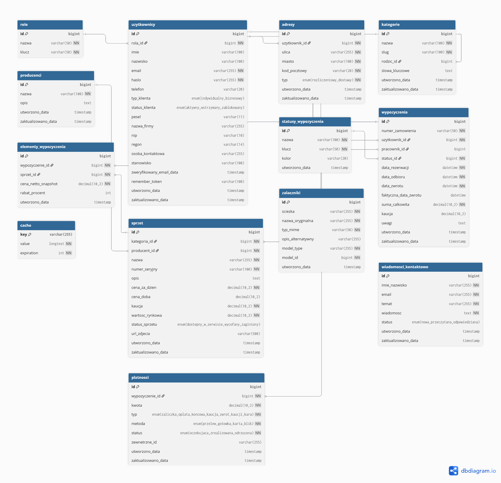

# Aplikacje Internetowe I 

**Autor:** Szymon Tułodziecki  
**Nr albumu:** 21312

---

## <span style="color: #3b82f6;">FilmoRent</span>

Aplikacja internetowa umożliwiająca wypożyczanie profesjonalnego sprzętu filmowego. System pozwala użytkownikom na przeglądanie dostępnego wyposażenia, składanie rezerwacji oraz zarządzanie wypożyczeniami w intuicyjny i efektywny sposób.

## <span style="color: #059669;">Wymagania Projektu</span>

### 1. <span style="color: #dc2626;">Struktura Bazy Danych</span>
- **Minimum 9 tabel** (w tym tabele generowane automatycznie przez Laravel)
- Migracje zapewniające kompatybilność z różnymi systemami zarządzania bazą danych
- Seedery generujące przykładowe dane dla wszystkich tabel

### 2. <span style="color: #f59e0b;">System Uprawnień</span>
Aplikacja rozróżnia trzy poziomy użytkowników:
- **Administrator** - pełny dostęp do wszystkich funkcji systemu
- **Pracownik** - dostęp do panelu zarządzania wypożyczeniami i obsługi zamówień klientów
- **Klient** - dostęp do przeglądania sprzętu, składania rezerwacji i zarządzania własnymi wypożyczeniami

### 3. <span style="color: #8b5cf6;">Architektura Aplikacji</span>
- **Frontend** - panel dla klientów z intuicyjnym interfejsem użytkownika
- **Backend** - panel administracyjny dla pracowników i administratorów

### 4. <span style="color: #ec4899;">Dostępność (WCAG)</span>
Aplikacja została zaprojektowana z myślą o osobach niepełnosprawnych:
- Wsparcie dla czytników ekranu
- Nawigacja klawiaturą
- Odpowiedni kontrast kolorów
- Opisowe etykiety i atrybuty ARIA
- Responsywny design

### 5. <span style="color: #10b981;">Kontrola Wersji</span>
Projekt zarządzany przy użyciu systemu **Git** z regularnym commitowaniem zmian.

### 6. <span style="color: #06b6d4;">Testy Jednostkowe</span>
Aplikacja zawiera **minimum 5 testów jednostkowych** weryfikujących poprawność działania kluczowych funkcjonalności.

## <span style="color: #6366f1;">Technologie</span>

- **Framework:** Laravel 11 + Filament 3
- **Baza danych:** Zgodna z różnymi systemami (MySQL, PostgreSQL, SQLite)
- **Frontend:** Tailwind CSS + Livewire
- **Kontrola wersji:** Git
- **Testy:** PHPUnit

```bash
cd aplikacja
composer install
npm install
php artisan migrate
php artisan db:seed
php artisan serve
```

Panel administracyjny: **http://localhost:8000/admin**


--- 

## <span style="color: #84cc16;">Diagram relacji bazy danych</span>

